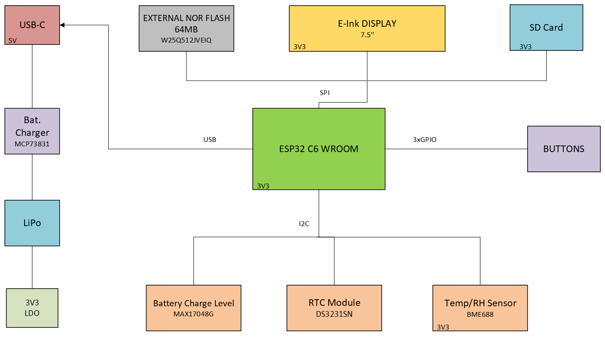

*Designed by Marius-Tudor Zaharia, 333CA, March 2025*

# OpenBook

---

## What is OpenBook?
* OpenBook is an implementation of a performant, yet accessible e-book reader,
following an open-source philosophy, with Wi-Fi connectivity.
* It focuses on minimalism and offers a distraction-free body, with three
physical buttons for efficient navigation.
* It also promotes environmental awareness, encompassing temperature, humidity,
air pressure and air quality sensors.

---

## Block diagram

---

## Hardware description
### PCB
* The design of the PCB is centered around an **ESP32 C6 WROOM** microcontroller,
equipped with a 32-bit RISC-V single-core processor, up to 160MHz.
    * It offers 320 KB ROM, 512KB HP SRAM, 16KB LP SRAM.
    * It comes with Wi-Fi 6 and Bluetooth LE connectivity.
    * Supports GPIO, SPI, UART, I2C, LED PWM.

* The **ESP32** supports *5 power modes*, each with a different power consumption index:
    * *Active* - between 160 and 260mA
    * *Modem Sleep* - between 3 and 20mA
    * *Light Sleep* - 0.8mA
    * *Deep Sleep* - 10uA
    * *Hibernation* - 2.5uA

* **Three Buttons** are connected to 3 GPIO pins of the ESP32, allowing the user
                    to control the device:
    * *Reset* to **pin 3 - Enable**
    * *Boot* to **pin 15 - GPIO 9**
    * *Change* to **pin 23 - GPIO 15**

* **SD Card** socket, which communicates by SPI protocol:
    * *pin 2 - CD/DAT3* to **pin 4 - GPIO 4**
    * *pin 3 - CMD* to **pin 7** (MOSI, i.e. Serial Data Out, for SPI)
    * *pin 7 - DAT0* to **pin 27** (MISO, i.e. Serial Data In, for SPI)
    * *pin 5* to **pin 6 - clock**

* **E-Paper Display Header**, interfacing the external E-Ink Display, also by SPI.

* **External NOR Flash Memory 64MB**, by SPI too:
    * *pin 1 - CS* to **pin 12 - GPIO 11**
    * *pin 2* to **MOSI** (for SPI)
    * *pin 5* to **MISO** (for SPI)
    * *pin 6* to **pin 6 - clock**

* **RTC Module** - Real Time Clock, using I2C protocol:
    * *pin 4 - Reset* to **pin 16 - GPIO 18**
    * *pin 16 - SCL* to **pin 20 - GPIO 22** (for I2C)
    * *pin 15 - SDA* to **pin 19 - GPIO 21** (for I2C)
    * *pin 1* to **pin 9 - GPIO 1** (for 32KHz)
    * *pin 3 - SQW/INT* to **pin 8 - GPIO 0**
    * Has a battery backup input for continuous timekeeping.

* **BME688** - Digital low power pressure, temperature, humidity and gas sensor,
               also interfaced through I2C:
    * *pin 4 - SCK* to **pin 20 - GPIO 22** (SCL for I2C)
    * *pin 15 - SDI* to **pin 19 - GPIO 21** (SDA for I2C)
    * *pins 2, 6, 8* to **pin 17 - GPIO 19** (for I2C PW)
    * Power consumption is 3.7uA at 1Hz humidity, pressure and temperature scan
        and 0.15uA in sleep mode.

* **USB-C connector** - for fast, efficient charging.

* **Li-Po Battery Charging Controller** - MCP73831

* **LDO Voltage Regulator**

* **Battery Charge Level** - *MAX17048G+T10*, communicates by I2C interface:
    * *pin 7 - SCL* to **pin 20 - GPIO 22**
    * *pin 8 - SDA* to **pin 19 - GPIO 21**
    * Power consumption is 23uA in Active state and 3uA in Hibernate.

### External
* **7.5" E-Paper Display**
* **2500mAh Battery - LP584174**

---

## Bill Of Materials
| Component | Price (EUR) | Count | Provider | Datasheet |
| :---      | :---        | :---  | :---     | :---      |
| ESP32 C6| 2.99 | 1 | https://eu.mouser.com/ProductDetail/Espressif-Systems/ESP32-C6-WROOM-1U-N8?qs=1Kr7Jg1SGW%2FzPU4G%252ByMwkA%3D%3D | https://eu.mouser.com/datasheet/2/891/Espressif_Systems_7_11_2023_esp32_c6_wroom_1_wroom-3236277.pdf |
| USB-C connector| 0.39 | 1 | https://eu.mouser.com/ProductDetail/Same-Sky/UJC-H-G-SMT-2-P6-TR?qs=IKkN%2F947nfApFV8T6rOqww%3D%3D |https://eu.mouser.com/datasheet/2/1628/ujc_h_g_smt_2_p6_tr-3511211.pdf |
| USBLC6-2SC6Y | 0.44 | 1 | https://eu.mouser.com/ProductDetail/STMicroelectronics/USBLC6-2SC6Y?qs=gNDSiZmRJS%2FOgDexvXkdow%3D%3D | https://eu.mouser.com/datasheet/2/389/usblc6_2sc6y-1852505.pdf |
| PFMF.050.1 | 0.28 | 1 | https://eu.mouser.com/ProductDetail/Schurter/PFMF.050.2?qs=1auRipcfynCums5v1iucSA%3D%3D | https://eu.mouser.com/datasheet/2/358/typ_PFMF-1275918.pdf |
| DMG2305UX-7 | 0.19 | 2 | https://eu.mouser.com/ProductDetail/Diodes-Incorporated/DMG2305UX-7?qs=L1DZKBg7t5F%2FNBHrjfxC%252Bg%3D%3D | https://www.diodes.com/assets/Datasheets/DMG2305UX.pdf |
| SD0805S020S1R0 | 0.3 | 2 | https://eu.mouser.com/ProductDetail/KYOCERA-AVX/SD0805S020S1R0?qs=jCA%252BPfw4LHbpkAoSnwrdjw%3D%3D | https://eu.mouser.com/datasheet/2/40/schottky-3165252.pdf |
| XC6220A331MR-G | 1.46 | 1 | https://eu.mouser.com/ProductDetail/Torex-Semiconductor/XC6220A331MR-G?qs=AsjdqWjXhJ8ZSWznL1J0gg%3D%3D | https://eu.mouser.com/datasheet/2/760/xc6220-3371556.pdf |
| TANT Capacitor | 0.68 | 1 | https://eu.mouser.com/ProductDetail/Vishay-Sprague/293D107X9010D2TE3?qs=8dfOI6wKXonVqFgS8%252BQ%2FMA%3D%3D | https://www.vishay.com/docs/40002/293d.pdf |
| 112A-TAAR-R03 | 1.1 | 1 | https://store.comet.srl.ro/Catalogue/Product/43497/ | https://store.comet.bg/download-file.php?id=27596 |
| 68uH inductance | 0.9 | 1 | https://eu.mouser.com/ProductDetail/Vishay-Dale/IFDC5050JZER680M?qs=iLKYxzqNS745SePZd8tBoA%3D%3D | https://www.vishay.com/docs/34635/ifdc5050jz.pdf |
| MBR0530 | 0.14 | 3 | https://eu.mouser.com/ProductDetail/Micro-Commercial-Components-MCC/MBR0530-TP?qs=KFo7JewZbUECRHkxGanrdg%3D%3D | https://eu.mouser.com/datasheet/2/258/MBR0520_MBR0580_SOD123_-2492194.pdf |
| SI1308EDL-T1-GE3 | 0.42 | 2 | https://eu.mouser.com/ProductDetail/Vishay-Semiconductors/SI1308EDL-T1-GE3?qs=bX1%252BNvsK%2FBramh9tgpOaEw%3D%3D | https://www.vishay.com/docs/63399/si1308edl.pdf |
| Capacitor 0.1uF | 0.3 | 1 | https://eu.mouser.com/ProductDetail/KYOCERA-AVX/KGF21BR71H104KT?qs=Jm2GQyTW%2FbjYyKCvVWAEOw%3D%3D | https://eu.mouser.com/datasheet/2/40/KGF-3223650.pdf |
| Capacitor 1uF | 0.13 | 10 | https://eu.mouser.com/ProductDetail/TAIYO-YUDEN/MAASL105CC7105MFCA01?qs=HFfMDpzxxd1Fn%2FInbJA7vw%3D%3D | https://eu.mouser.com/datasheet/2/396/TAIYO_YUDEN_04_27_2024_c_mlcc_A_e1-3451516.pdf |
| Capacitor 4.7uF | 0.23 | 5 | https://eu.mouser.com/ProductDetail/KYOCERA-AVX/CM05X5R475M16AH?qs=doiCPypUmgFT1xquZKhWtQ%3D%3D | https://eu.mouser.com/datasheet/2/40/Kyocera_AVX_Components_CM025_CM05_CM105_CM21_E217K-2932876.pdf |
| Capacitor 10 uF | 0.47 | 1 | https://eu.mouser.com/ProductDetail/TDK/CGA3EDX7T1A106M080AU?qs=ZcfC38r4PovL%2FBNBUzzBFw%3D%3D | https://product.tdk.com/system/files/dam/doc/product/capacitor/ceramic/mlcc/catalog/mlcc_automotive_general_en.pdf |
| Capacitor 100nF | 0.3 | 8 | https://eu.mouser.com/ProductDetail/KYOCERA-AVX/KAM21BR71H104JT?qs=Jm2GQyTW%2Fbic6Zk4McEt6w%3D%3D | https://eu.mouser.com/datasheet/2/40/AutoMLCCKAM-3216307.pdf |
| Resistor 0.47 | 0.3 | 1 | https://eu.mouser.com/ProductDetail/SEI-Stackpole/RNCL1210FT50L0?qs=17ckDYBRdelVLOJ%252BDFjlUw%3D%3D | https://eu.mouser.com/datasheet/2/385/sei_rncl-3223524.pdf |
| Resistor 2.2 | 0.13 | 1 | https://eu.mouser.com/ProductDetail/YAGEO/RT1206FRE072R2L?qs=XhSZopxZ3H6S0nYZD83pAA%3D%3D | https://eu.mouser.com/datasheet/2/447/PYu_RT_1_to_0_01_RoHS_L_15-3461507.pdf |
| Resistor 15 | 0.25 | 1 | https://eu.mouser.com/ProductDetail/Panasonic/ERA-6AHD150V?qs=MNPzkKEzRtQip8ZeekU%252BRw%3D%3D | https://industrial.panasonic.com/cdbs/www-data/pdf/RDM0000/AOA0000C307.pdf |
Resistor 200 | 0.33 | 1 | https://eu.mouser.com/ProductDetail/TE-Connectivity-Holsworthy/RP73C2B200RFTDF?qs=n4i9pByFsMR0dWGpf721CA%3D%3D | https://eu.mouser.com/datasheet/2/418/10/ENG_DS_1773272_M1-1588495.pdf |
| Resistor 2k | 0.16 | 1 | https://eu.mouser.com/ProductDetail/Panasonic/ERA-3AED202V?qs=yocZuyCaXdM2cBmjcGkIyA%3D%3D | https://industrial.panasonic.com/cdbs/www-data/pdf/RDM0000/AOA0000C307.pdf |
| Resistor 5k1 | 0.15 | 2 | https://eu.mouser.com/ProductDetail/Vishay-Beyschlag/MCS04020C5101FE000?qs=wTZ%2FFzl837YsKPLPRIXUbg%3D%3D | https://www.vishay.com/docs/28705/mcx0x0xpro.pdf |
| Resistor 10k | 0.32 | 16 | https://eu.mouser.com/ProductDetail/SEI-Stackpole/RNWA0612BTE10K0?qs=IKkN%2F947nfD62pDKWE9ZTQ%3D%3D | https://eu.mouser.com/datasheet/2/385/SEI_RNWA-3473840.pdf |
| Resistor 100K | 0.1 | 1 | https://eu.mouser.com/ProductDetail/Panasonic/ERA-3AED104V?qs=MNPzkKEzRtQIWcmUWL4kjg%3D%3D | https://industrial.panasonic.com/cdbs/www-data/pdf/RDM0000/AOA0000C307.pdf |
| MCP73831 | 0.75 | 1 | https://eu.mouser.com/ProductDetail/Microchip-Technology/MCP73831-2ACI-MC?qs=hH%252BOa0VZEiBneYTVdpuVdg%3D%3D | https://eu.mouser.com/datasheet/2/268/MCP73831_Family_Data_Sheet_DS20001984H-3441711.pdf |
| FH34SRJ-24S-0.5SH(99) | 2.6 | 1 | https://eu.mouser.com/ProductDetail/Hirose-Connector/FH34SRJ-24S-0.5SH99?qs=vcbW%252B4%252BSTIpKBl5ap9J8Fw%3D%3D | https://eu.mouser.com/datasheet/2/185/FH34SRJ_24S_0_5SH_99__CL0580_1255_6_99_2DDrawing_0-1615044.pdf |
| BME688 | 9.86 | 1 | https://eu.mouser.com/ProductDetail/Bosch-Sensortec/BME688?qs=IS%252B4QmGtzzqQoVDscqwx3A%3D%3D | https://eu.mouser.com/datasheet/2/783/bst_bme688_fl000-2307034.pdf |
| BD5229G-TR | 0.75 | 1 | https://eu.mouser.com/ProductDetail/ROHM-Semiconductor/BD5229G-TR?qs=4kLU8WoGk0vvnhrrYwdszw%3D%3D | https://fscdn.rohm.com/en/products/databook/datasheet/ic/power/voltage_detector/bd52xxg-e.pdf |
| MAX17048G+T10 | 4.28 | 1 | https://eu.mouser.com/ProductDetail/Analog-Devices-Maxim-Integrated/MAX17048G%2bT10?qs=D7PJwyCwLAoGnnn8jEPRBQ%3D%3D | https://eu.mouser.com/datasheet/2/609/MAX17048_MAX17049-3469099.pdf |
| DS3231SN# | 14.91 | 1 | https://eu.mouser.com/ProductDetail/Analog-Devices-Maxim-Integrated/DS3231SN?qs=1eQvB6Dk1vhUlr8%2FOrV0Fw%3D%3D | https://eu.mouser.com/datasheet/2/609/DS3231-3421123.pdf |
| CPH3225A | 2.33 | 1 | https://eu.mouser.com/ProductDetail/Seiko-Semiconductors/CPH3225A?qs=3etwrb1wR%252BhUOph6lAO7eg%3D%3D | https://eu.mouser.com/datasheet/2/360/Seiko_Instruments_MicroBattery_E_20230330_2024Jan_-3561061.pdf |
| Qwiic | 3.75 | 1 | https://eu.mouser.com/ProductDetail/Adafruit/4208?qs=PzGy0jfpSMtbScLbr0L5dw%3D%3D | https://learn.adafruit.com/introducing-adafruit-stemma-qt/technical-specs |
| PGB1010603MR | 0.4 | 6 | https://eu.mouser.com/ProductDetail/Littelfuse/PGB1010603MR?qs=gu7KAQ731URLg4GSnNNN7Q%3D%3D | https://www.littelfuse.com/assetdocs/pulseguard-esd-suppressors-pgb1-datasheet?assetguid=8a337998-d54d-466b-be4e-dc5bcd1f9321 |
| W25Q512JVEIQ | 5.84 | 1 | https://eu.mouser.com/ProductDetail/Winbond/W25Q512JVEIQ?qs=l7cgNqFNU1jw6svr3at6tA%3D%3D | https://eu.mouser.com/datasheet/2/949/Winbond_W25Q512JV_Datasheet-3240039.pdf |
| LP584174 Battery| 6.4 | 1 | https://www.tme.eu/en/details/accu-lp584174_cl/rechargeable-batteries/cellevia-batteries/l584174/ | https://www.tme.eu/Document/e0683d8c34e6d878124489f71bffb6ee/cel0014.pdf |
| E-Paper Display | 48 | 1 | https://eu.mouser.com/ProductDetail/Microtips-Technology/MT-DEPG0750BNU590F1?qs=DPoM0jnrROVRMMTX0WzK%252Bw%3D%3D | https://eu.mouser.com/datasheet/2/271/MT_DEPG0750BNU590F1_V2_7-1894282.pdf |

* **Total Cost** : 124.66 EUR

---

## Implementation steps
* Firstly, I drew the schematic, with all the components.
* I drew the shape of the PCB, then I placed the components, all of them on the
top plane, taking into account the position they will occupy in the external case.
* I drew the ground plane for both top and bottom, then I used the autorouter to
shape the routes. I manually routed those that were left as airwires.
* I set the power routes to a width of 0.3mm and solved all the issues from the
DRC check, like the angles of the routes.
* After fine-tuning the silkscreen, I pushed the PCB to 3D and placed it into
the case.
